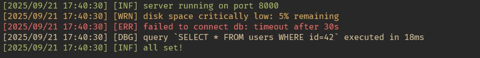

# loggi

Yet another simple Go colored logger.

## Installation
```bash
go get github.com/erhaem/loggi@latest
```

## Example Usage
```go
package main

import (
	"fmt"
	"time"

	"github.com/erhaem/loggi"
)

func main() {
	port := 8000
	loggi.Info(fmt.Sprintf("server running on port %d", port))

	diskFree := 5
	loggi.Warn(fmt.Sprintf("disk space critically low: %d%% remaining", diskFree))

	dbErr := fmt.Errorf("timeout after %ds", 30)
	loggi.Error(fmt.Sprintf("failed to connect db: %v", dbErr))

	query := "SELECT * FROM users WHERE id=42"
	duration := 18 * time.Millisecond
	loggi.Debug(fmt.Sprintf("query `%s` executed in %v", query, duration))

	loggi.Info("all set!")
}
```
## Screenshot

